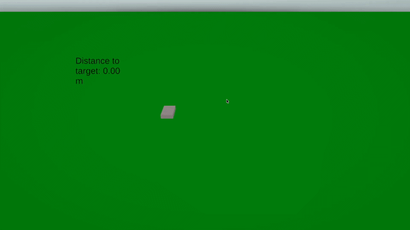
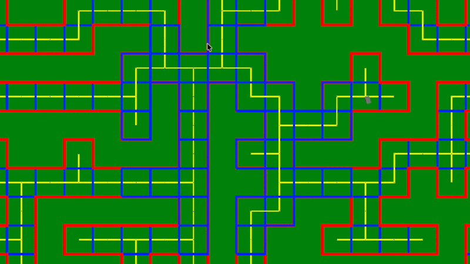

# NavMesh Generation — UCSC CMPM 146 (Game AI)

Unity implementation of an AI agent that navigates arbitrary spaces using steering behaviors, A* pathfinding, and procedural NavMesh generation.

## Overview

A 3-part series building a fully autonomous navigation system from scratch in Unity (C#):

| Assignment | Topic | Description |
|---|---|---|
| 1 | Steering Seek | NPC moves to a click target using smooth acceleration/deceleration and follows waypoint paths |
| 2 | A* Pathfinding | Agent navigates a graph-represented maze, routing around walls to reach any destination |
| 3 | NavMesh Generation | Converts level geometry into convex polygon graph nodes so the agent can navigate any arbitrary space |

## Demos

### Assignment 1: Steering Seek

### Assignment 2: A* Pathfinding

### Assignment 3: NavMesh Generation

## Features
- Kinematic movement with smooth acceleration and velocity ramping
- Path following with corner slowdown logic
- A* pathfinding on graph-represented maps
- Procedural NavMesh generation by splitting level geometry into convex polygons
- Agent navigates fully arbitrary spaces at runtime

## Tech Stack
- Unity (C#)
- Unity NavMesh API
- TextMeshPro

## Course
CMPM 146 — Game AI, UC Santa Cruz
